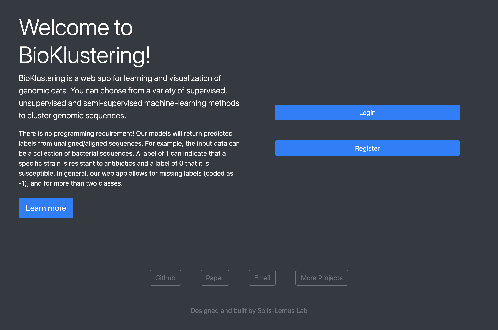
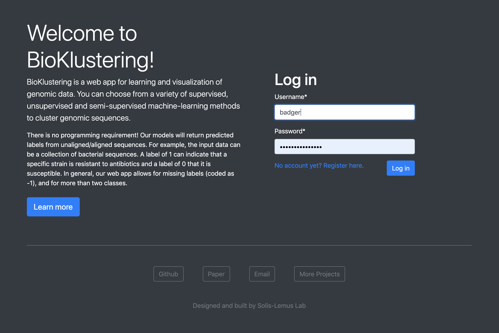
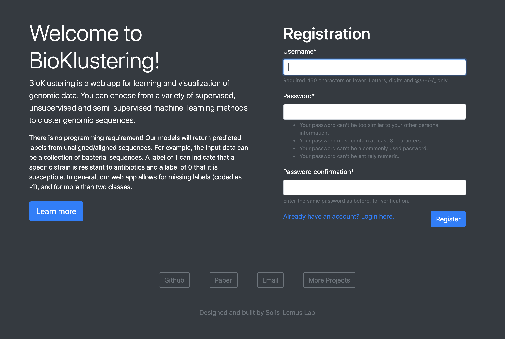

# BioKlustering Documentation
BioKlustering is a web app for semi-supervised learning of maximally unbalanced genomic data.
Accurate phenotype prediction from genomic sequences is a highly coveted task in biological and medical research. While machine-learning holds the key to accurate prediction in a variety of fields, the complexity of biological data can render many methodologies inapplicable.
We introduce BioKlustering, a user-friendly open-source and publicly available web app for unsupervised and semi-supervised learning specialized in cases when sequence alignment and/or experimental phenotyping of all classes are not possible. 
Among its main advantages, BioKlustering 1) allows for maximally unbalanced settings of partially observed labels including cases when only one class is observed, which is currently prohibited in most semi-supervised methods, 2) takes unaligned sequences as input and thus, allows learning for widely diverse sequences (impossible to align) such as virus and bacteria, 3) is easy to use for anyone with little or no programming expertise, and 4) works well with small sample sizes.

The following shows the hirearchy of the website:
* [Welcome Page](#Welcome-Page)
* [Sign In](#Sign-In-Page) / [Sign Up](#Sign-Up-Page)
* [Home Page](#Home-Page)
    * [Upload Section](#Upload-Section)
    * [Predict Section](#Predict-Section)
* [FAQ](#FAQ-Page)
* [Result Page](#Result-Page)

## Welcome Page
The welcome page contains the description of the website and links to sign in and sign up.

## Sign In Page
The sign in page is where users log in their account

## Sign Up Page
The sign up page is where users register a new account

## Home Page
The home page contains two sections: 1) for uploading files and 2) for fitting the machine-learning models.

#### Upload Section
* There are two types of files: 1) sequence file (required) and 2) label file (optional).
    * Sequence file should be a fasta file that contains genome sequences
    * Label file should be a csv file that contains labels of genome sequences. You should use -1 for unknown labels  
* There are two ways of uploading files. The sequence file is required in either way:                          
    * For unsupervised models, you only need to upload a sequence file     
    * For semi-supervised models, you need to upload a sequence file and a label file in a pair. Please make sure that the order of the sequences matches the order of labels
* You can upload files multiple times and they will be saved to your file list. Once you decide which model to use, you can select files from your file list for fitting the model
* Note that the files will be removed regularly after a period of time for saving space
* Do not save files that contain sensitive data on the website. Please delete such files after fitting the models
#### Predict Section
* There are 3 machine-learning models implemented in the website: 
    * [kmeans](https://en.wikipedia.org/wiki/K-means_clustering)
    * [gaussian mixture model](https://en.wikipedia.org/wiki/Mixture_model)
    * [spectral clustering](https://en.wikipedia.org/wiki/Spectral_clustering)
* Each model currently has two options:
    * unsupervised (when no labels are included)
    * semi-supervised (when partial labels are included)
* After you choose a model, the parameters will be updated dynamically. 
    * In case you are not sure about how to fill in the parameters, we provide default values and they are already filled in the form
    * You can change the parameter values as you need
    * For more information about how to fill in the parameters, you can find the description of each model and its parameters by clicking 'Learn more about X' button.
* If you want the results to be sent through email, you can fill in your email address after choosing a model and remember to click the checkbox and save button. Once you click the predict button, the results will be sent through the email after the prediction is done
                                                             

## FAQ Page
The FAQ Page contains questions and answers to common problems and doubts.

## Result Page
* The result page contains:
    * an interactive plot built by Plotly Dashboard
    * a table with predicted labels
* Users can download the results in a zip file which includes:
    * a static plot
    * a csv that contains the table with predicted labels
    * a txt that contains the parameter information used to run the models

# Feedback
* Issues reports are encouraged through the [GitHub Issue Tracker](https://github.com/solislemuslab/bioklustering/issues).
* Feedback is always welcome via the following [Google Form](https://forms.gle/SUYQ6X3WNotpQphj6).

