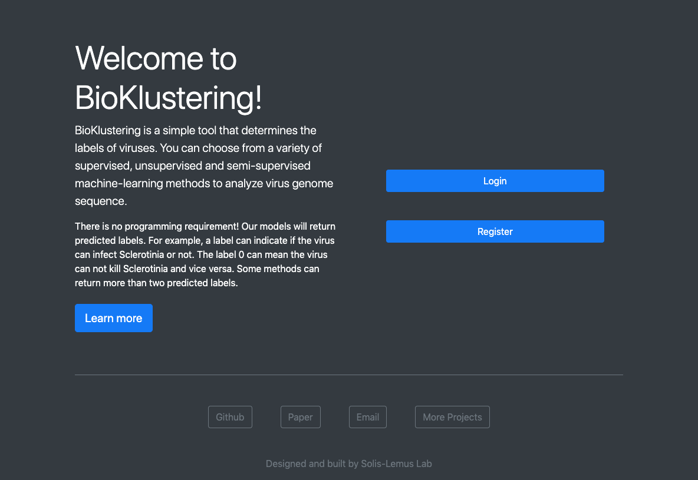
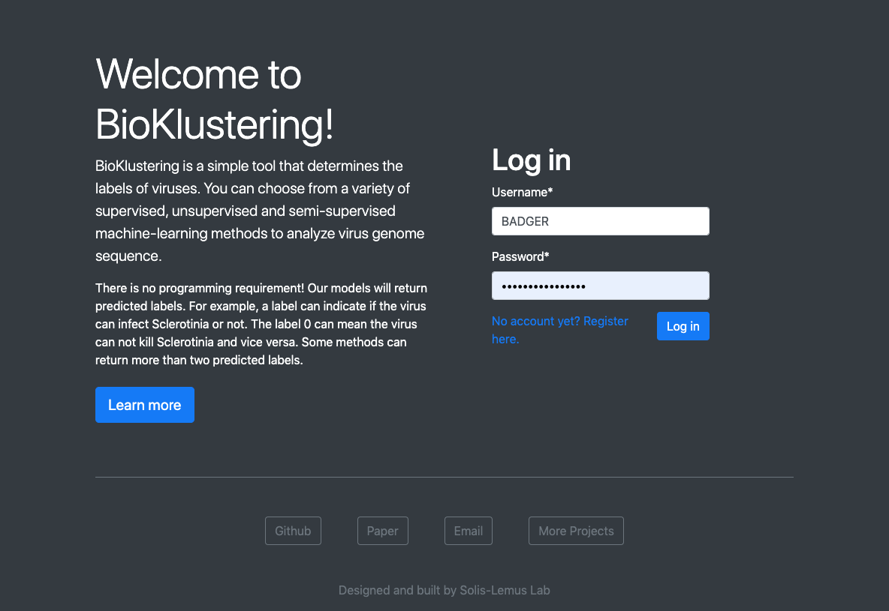

# BioKlustering Documentation
BioKlustering is a simple tool that determines the labels of viruses. Users can choose from a variety of supervised, unsupervised and semi-supervised machine-learning methods to analyze virus genome sequence.

The following shows the hirearchy of the wesite:
* [Welcome Page](#-Welcome-Page)
* [Sign In](#-Sign-In-Page) / [Sign Up](#-Sign-Up-Page)
* [Home Page](#-Home-Page)
    * [Upload Section](#-Upload-Section)
    * [Predict Section](#-Predict-Section)
* [FAQ](#-FAQ-Page)
* [Result Page](#-Result-Page)

## Welcome Page
The welcome page contains the description of the website and links to sign in and sign up.

## Sign In Page
The sign in page where users log in their account

## Sign Up Page
The sign up page where users register a new account

## Home Page
The home page contains two sections. One is for uploading files and the other is for making prediction.
#### Upload Section
* There are two types of files. One is sequence file and the other is label file:
    * Sequence file should be a fasta file that contains genome sequences
    * Label file should be a csv file that contains labels of genome sequences. You should use -1 for unknown labels.  
* There are two ways of uploading files. The sequence file is required in either way:                          
    * For unsupervised models, you only need to upload a sequence file.       
    * For semi-supervised models, you need to upload a sequence file and a label file in a pair. Make sure the order of seqeunces matches the order of labels.
* You can upload files multiple times and they will be saved to your filelist. Once you decide which model to use, you can select files from your filelist for running the prediction.
* Notice that the files will be removed regularly after a period of time for saving space.
* Do not save files that contain sensitive data on the website. Please delete such files after running the prediction.
#### Predict Section
* There are 3 models: 
    * kmeans
    * guassian mixture model
    * spectral clustering
* Each model currently has two options:
    * unsupervised
    * semi-supervised
* After you choose a model, the parameters will be updated dynamically. 
    * In case you are not sure about how to fill in the parameters, we provide default values and they are already filled in the form.
    * You can change the values as you need. 
    * For more information about how to fill in the parameters, you can find the description of each model and its parameters by clicking 'Learn more about xxx' button.
* If you want the results to be sent through email, you can fill in your email address after choosing a model and remember to click the checkbox and save button. Once you click the predict button, the results will be sent through the email after the prediction is done.
                                                             

## FAQ Page
The FAQ Page

## Result Page
* The result page contains:
    * an interactive plot built by plotly dashboard
    * a table with predicted labels
* Users can download the results in a zip file which includes:
    * a static plot
    * a csv that contains the table
    * a txt that contains the parameter information

## Feedback
* Issues reports are encouraged through the [GitHub Issue Tracker](https://github.com/solislemuslab/bioklustering/issues).
* Feedback is always welcome via the following [Google Form](https://forms.gle/SUYQ6X3WNotpQphj6).

